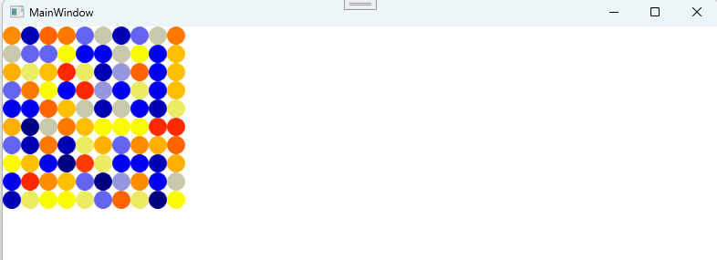

# 🌡️ TempVisual: 온도 데이터 시각화 WPF 프로젝트

이 프로젝트는 업무에서 처음으로 받은 과제를 기반으로 작업한 WPF 애플리케이션입니다.  
`Cell.csv` 파일에 저장된 위치 및 온도 데이터를 불러와, 각 데이터를 색상과 좌표 기반의 원으로 캔버스에 시각화합니다.

## 🛠️ 주요 기능
- 📂 CSV 파일(Cell.csv)로부터 온도 데이터 읽기
- 🎨 온도값에 따라 색상을 매핑하여 시각적으로 표현
- ⚪ Canvas 위에 원(Ellipse) 형태로 각 지점 표시
- 💬 각 원에 툴팁(ToolTip)을 추가하여 meter 및 온도 정보 표시

## 📁 CSV 파일 형식
```
측정지점(Meter), 온도값(Temp), 왼쪽 좌표(Left), 위쪽 좌표(Top)
1M,41.69,0,0
2M,3.36,20,0
...
```

## 💡 개발 배경
이 코드는 회사에서 첫 업무로 받은 과제였으며,  
*CSV 기반 데이터 가공 및 시각화 처리*를 연습하고 실제 업무에 적용해보는 데 큰 도움이 되었습니다.  
처음부터 직접 기획하고 구성하면서 **클래스 분리**, **데이터 파싱**, **UI 요소 생성**, **툴팁 처리**, **색상 매핑** 등을 경험할 수 있었습니다.

## 🖥️ 실행 방법
1. Visual Studio로 프로젝트 열기
2. 실행 전, 실행 파일과 동일한 폴더에 Cell.csv 파일이 존재해야 함
3. 프로그램 실행 시 자동으로 원들이 그려지고, 마우스를 올리면 상세 정보가 표시됨

## 📸 결과 화면


## 🗂️ 포함 파일 구성
- MainWindow.xaml, MainWindow.xaml.cs : 메인 화면 및 로직
- GetData.cs, GetColor.cs : 데이터 처리 및 색상 매핑 클래스
- Cell.csv : 시각화 대상 원본 데이터
- README.md : 프로젝트 설명 문서
- .gitignore : Visual Studio 설정 및 빌드 결과물 제외

> 📌 .sln(솔루션) 파일은 GitHub에 포함되어 있어 Visual Studio에서 바로 열 수 있습니다.

## 🗂️ 향후 개선 방향
- 캔버스 크기 자동 조정 또는 스크롤 기능 추가
- 색상 가시성을 높이기 위한 외곽선(Stroke) 기능 도입
- 예외 처리 추가 (파일 없음, 데이터 파싱 오류 등)
- MVVM 구조로의 확장 가능성 검토

## ⚠ 개선 포인트 적용 내역
- ✅ **예외 처리**: 잘못된 CSV 형식 또는 파싱 실패를 try-catch로 처리
- ✅ **Canvas 확장**: 좌표 최대값 기준으로 크기 자동 설정
- ✅ **스크롤 지원**: ScrollViewer 추가
- ✅ **색상 구분**: 원에 테두리(Stroke) 추가

## 🙌 마무리
작지만 WPF의 핵심 기능들을 다뤄본 좋은 경험이었고,  
실제 업무 데이터를 어떻게 시각화할 수 있을지에 대한 기초를 배운 의미 있는 프로젝트였습니다.  
📌 이 프로젝트는 제 개인 포트폴리오의 일부이며, 실제 업무 환경에서 처음으로 맡은 개발 과제를 기반으로 구현하였습니다.
